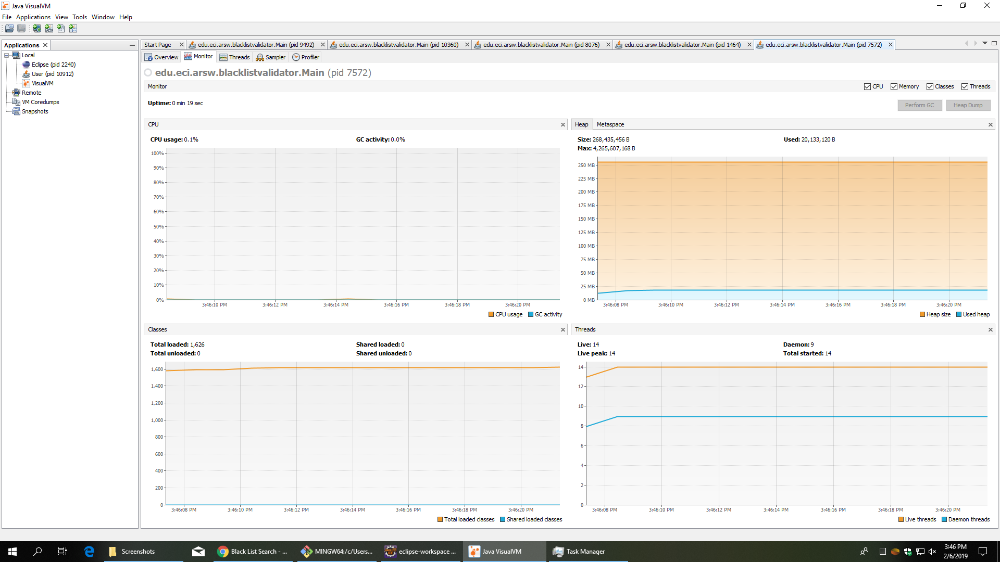

# Lab3_ARSW

## Part l

With the run method we have organized result:

And start method a diorganized result:

That´s because the `start()` creat new thread for each call and `run()` doesn´t

## Part ll

So many checked lists is because each thread is working on your own and only stops when found the limit of list that in this case is 5

## Part lll - Discussion

The only way I think you can minimize the number of queries in these cases, is to send lower ranges of servers to each thread.

"" Part lV - Performance Evaluation

With single thread:

With 4 threads:

With 8 threads:

In the above we can see that my program run so fast and can no detect CPU usage at all. That´s because I do not continue with more threads.